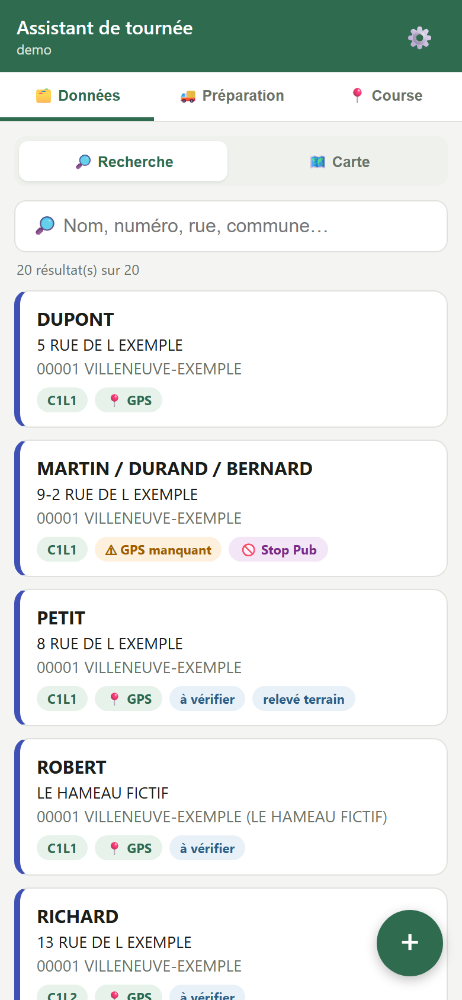
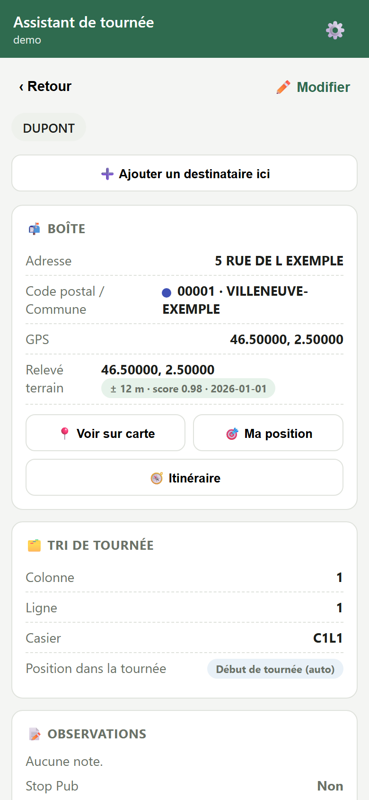
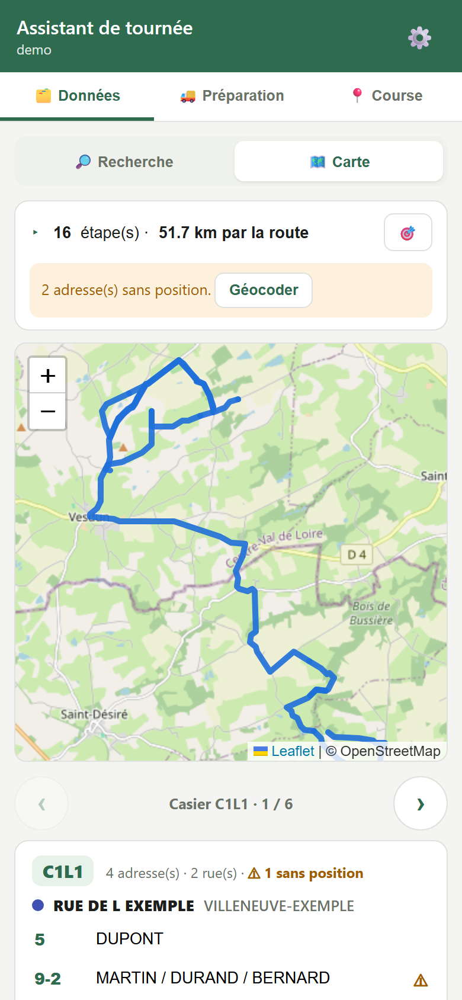
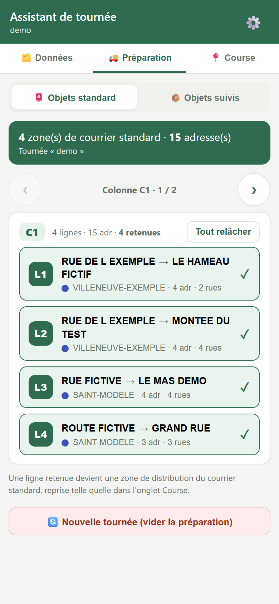
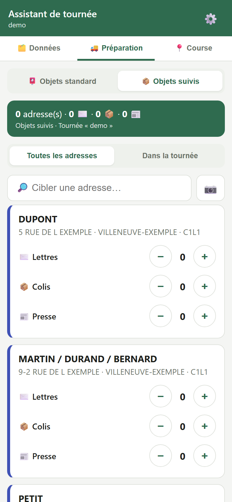
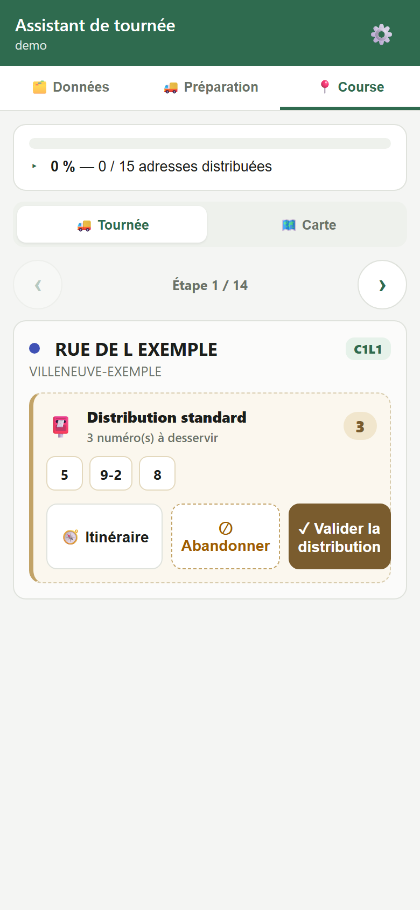
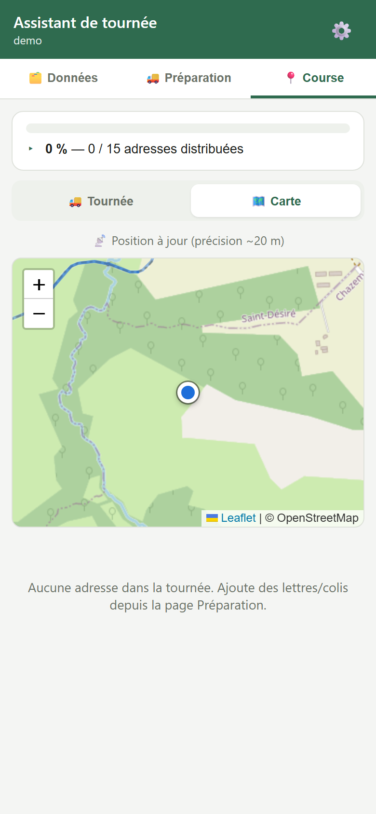
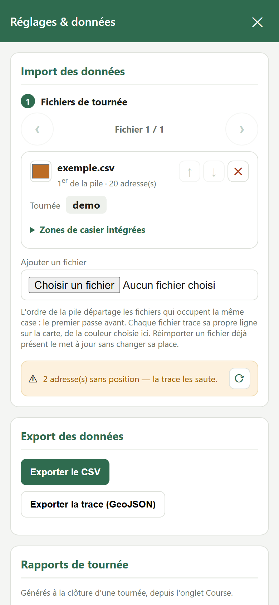

# Assistant de tournée

Application web vibe codée (PWA, mobile-first) pour préparer et suivre une tournée de distribution : classement des adresses par casier de tri, préparation du courrier et des objets suivis, puis distribution guidée avec carte et clôture de tournée.

Aucun serveur, aucune base de données : tout tourne dans le navigateur et les données restent sur l'appareil (voir [Vie privée et stockage](#vie-privée-et-stockage)).

## Sommaire

- [Démarrer l'application](#démarrer-lapplication)
- [Structure des fichiers du projet](#structure-des-fichiers-du-projet)
- [Structure des données](#structure-des-données)
- [Les trois volets](#les-trois-volets)
  - [🗂️ Données](#️-données)
  - [🚚 Préparation](#-préparation)
  - [📍 Course](#-course)
- [⚙️ Réglages](#️-réglages)
- [Vie privée et stockage](#vie-privée-et-stockage)

## Démarrer l'application

Aucune installation, aucune dépendance à construire : c'est du HTML/CSS/JS statique. Il suffit de le servir avec n'importe quel serveur de fichiers, par exemple :

```bash
python -m http.server 8777
```

puis ouvrir `http://localhost:8777`. L'application est aussi installable comme PWA (icône sur l'écran d'accueil, plein écran).

Au premier lancement, la base est vide. Ouvrir les réglages (⚙️, en haut à droite) et soit importer un CSV, soit cliquer sur **Charger un exemple** (dans « Réglages avancés ») pour explorer l'application avec un jeu de données fictif.

## Structure des fichiers du projet

```
index.html          Page unique, structure des trois volets et des overlays
css/styles.css       Toute la mise en forme
js/
  store.js          Schéma des données, persistance locale, import/export CSV, tri de tournée
  prep.js           Préparation du jour (zones de courrier, objets suivis) et clôture/rapports
  geocode.js         Recherche d'adresse (géocodage) via l'API cartes.gouv.fr / IGN
  mapview.js         Fine couche au-dessus de Leaflet (fabrique de cartes)
  parcours.js         Reconstruction et tracé du parcours de tournée (étapes, distance)
  scan-core.js         Mécanique du scan d'étiquette (états, cadence, rapprochement) sans caméra ni DOM
  scan.js             Scan d'étiquette par la caméra : caméra, OCR (Tesseract.js), interface
  ui.js               Tous les écrans (Recherche/Fiche/Carte, Préparation, Course, Réglages)
  app.js              Point d'entrée (démarre l'interface)
tests/                Bancs d'essai Node sans dépendance (voir tests/README.md)
```

`ui.js` réécrit le HTML des conteneurs à chaque changement d'état (pas de framework) ; les autres modules sont des bibliothèques pures que `ui.js` appelle.

## Structure des données

La donnée de référence est une **liste d'adresses**, une par destinataire (ou groupe de destinataires à la même boîte). Elle s'importe et s'exporte en CSV depuis les [Réglages](#️-réglages), et vit ensuite uniquement dans le navigateur.

### Colonnes du CSV

| Colonne | Contenu |
|---|---|
| `id` | Identifiant unique de la ligne |
| `id_tournee` | Identifiant de la tournée (ex. `tm002`) |
| `nom_famille` | Nom(s) du/des destinataire(s) ; plusieurs noms à la même boîte se séparent par `\|` (ex. `DUPONT\|MARTIN`) |
| `numero`, `rue`, `code_postal`, `commune`, `lieu_dit` | Adresse postale |
| `latitude`, `longitude` | Position retenue pour la carte et le tri |
| `geocode_statut` | `geocode` (calculée automatiquement) ou `verifie` (confirmée par un relevé GPS de terrain) |
| `lat_relevee`, `lon_relevee`, `precision_m`, `releve_le` | Dernier relevé GPS de terrain (voir plus bas) |
| `casier_c`, `casier_l` | Colonne (1 à 5) et ligne (1 à 4) du casier de tri : la case physique où classer l'adresse |
| `ordre_zone`, `ordre_rue` | Ordre de passage à l'intérieur d'une même case de casier |
| `position_manuelle` | Force la position dans la tournée (`debut`/`milieu`/`fin`) plutôt que la position calculée |
| `type_objet` | `lettre`, `colis` ou `presse` |
| `notes` | Note libre (accès, code, animal…) |
| `stoppub` | Boîte « Stop Pub » |
| `date_maj` | Date de dernière modification |

Un fichier plus ancien qui n'a pas encore les colonnes de relevé GPS reste valide : elles se remplissent d'elles-mêmes au premier relevé de terrain.

### Le casier, seule source de vérité de l'ordre

L'ordre d'affichage — sur la carte, en Préparation, en Course — se calcule **à partir des données**, jamais l'inverse : une case de casier (`casier_c`/`casier_l`), puis `ordre_zone`/`ordre_rue` à l'intérieur de la case. Une adresse sans case de casier est classée « hors casier » (elle vient généralement d'une autre tournée) et passe après les adresses casées.

### Empilement de plusieurs fichiers

Les réglages permettent d'empiler plusieurs fichiers de tournée (par exemple une tournée principale et un renfort). Chaque fichier garde sa propre trace sur la carte, sa propre couleur, et l'ordre de la pile départage deux fichiers qui occupent la même case de casier — sans jamais fusionner leurs cases entre eux.

### Relevé GPS de terrain

Une adresse géocodée automatiquement (`geocode_statut = geocode`) peut être **confirmée sur le terrain** : en Course, valider la distribution d'une adresse capture la position GPS du moment. Un score de confiance (`1 − précision/700`, avec des seuils à 0,85 et 0,95) décide si ce relevé est assez bon pour être proposé comme correction ; une position déjà `verifie` ne se corrige plus qu'à la main, depuis la fiche.


## Les trois volets

L'application s'organise en trois onglets, accessibles en haut de l'écran.

### 🗂️ Données

La base d'adresses : consulter, chercher, corriger.

**Recherche**



Une barre de recherche (nom, numéro, rue, commune) et la liste des adresses sous forme de cartes. Chaque carte affiche la case de casier et des indicateurs : `GPS` / `GPS manquant`, `à vérifier` (position calculée mais jamais confirmée sur le terrain), `relevé terrain`, `Stop Pub`. Le bouton **+** en bas à droite ajoute une adresse. Toucher une carte ouvre sa fiche.

**Fiche**



Détail et modification d'une adresse : coordonnées GPS et relevé de terrain (avec accès direct à la carte, à sa propre position, ou à un itinéraire), position dans le casier et dans la tournée, observations (notes, Stop Pub). Le bouton **Modifier** passe la fiche en édition.

**Carte**



La tournée reconstituée comme une suite d'étapes (et non un nuage de points) : distance totale par la route, alerte sur les adresses sans position (avec un bouton pour les géocoder), et en dessous un navigateur de casier qui liste les adresses case par case.

### 🚚 Préparation

Ce qu'il y a à distribuer aujourd'hui — toujours séparé de la base d'adresses : vider la préparation ne touche jamais aux adresses.

**Objets standard**



Le courrier non suivi se retient par case de casier : on parcourt les colonnes du casier et on coche les lignes à distribuer (**Tout retenir** en coche une colonne entière d'un coup). Une ligne retenue devient une zone de distribution, reprise telle quelle dans l'onglet Course.

**Objets suivis**



Les lettres, colis et presse suivis s'attribuent adresse par adresse avec des compteurs +/-. Le filtre **Dans la tournée** limite la liste à ce qui a déjà été attribué. Le bouton caméra ouvre le **scan d'étiquette** : la caméra lit le texte d'une étiquette (OCR local, dans le navigateur), et l'application propose l'adresse connue qui s'en rapproche le plus — rien n'est jamais attribué automatiquement, le choix final revient à l'utilisateur.

Le bouton **Nouvelle tournée** vide la préparation (zones et objets suivis) pour repartir de zéro sans toucher à la base d'adresses.

### 📍 Course

La distribution proprement dite, guidée étape par étape.

**Tournée**



Une barre de progression globale, puis un carrousel d'étapes (une rue ou une case de casier à la fois) avec ce qu'il reste à distribuer. Chaque étape se **valide** (la distribution est faite), s'**abandonne** (à reprendre plus tard) ou s'ouvre en **itinéraire** vers l'application de navigation du téléphone. Clore la tournée depuis cet onglet génère un rapport, archivé dans les réglages.

**Carte**



La position en temps réel (si la géolocalisation est autorisée) et les adresses à proximité, sur la même carte que celle des Données.

## ⚙️ Réglages

Accessibles par l'icône ⚙️ en haut à droite, à tout moment.

- **Import des données** : charger un ou plusieurs fichiers CSV, réordonner la pile, choisir la couleur de trace de chaque fichier.
- **Export des données** : CSV (tout ou une sélection de tournées) et trace GeoJSON.
- **Rapports de tournée** : consulter, télécharger ou supprimer les rapports générés à chaque clôture.
- **Apparence** : couleur du repère et de la pastille de chaque commune.
- **Réglages avancés** : activer/désactiver le géocodage automatique, activer/désactiver et régler le scan d'étiquette (mode vidéo continu ou déclenchement photo, fréquence de lecture, sens de rotation), afficher les flèches de sens sur la trace, charger le jeu d'exemple, vider les données.



## Vie privée et stockage

Toutes les données (adresses, préparation, réglages, rapports) sont stockées uniquement dans le navigateur (`localStorage`) : rien n'est envoyé à un serveur applicatif. Deux services externes sont sollicités ponctuellement, et seulement avec le strict nécessaire :

- le **géocodage** envoie l'adresse texte (numéro, rue, code postal, commune) à l'API cartes.gouv.fr / IGN, jamais de nom ni de donnée nominative ;
- la **carte** charge des tuiles depuis OpenStreetMap ;
- le **scan d'étiquette** effectue l'OCR entièrement dans le navigateur (Tesseract.js) : aucune image n'est transmise nulle part.

Vider les données (réglages avancés) efface tout ce qui est stocké localement.
